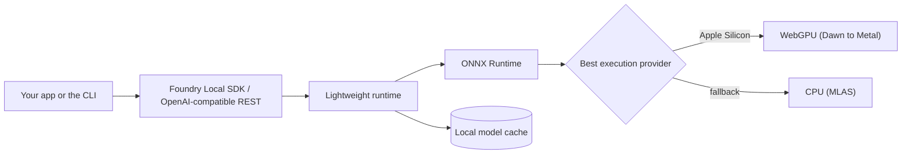

# Ragnar-Local-Foundry

**A complete, research-backed blueprint and automation kit for running Azure AI Foundry Local on a Mac (Apple Silicon).**

> Clone it, run three commands, and you have a private, offline, OpenAI-compatible AI foundry running entirely on your own machine. No cloud, no per-token cost, no API keys, no Azure subscription. Your data never leaves the device.

This repo is both the **research** (what Foundry Local is, how it works, which models to run, how it performs on Apple Silicon) and the **build system** (scripts + a Makefile that download, install, serve, and test it end to end).

*Maintained by Ragnar Pitla. Views expressed here are my own and do not represent Microsoft's official position.*

---

## Table of contents

- [What is Foundry Local](#what-is-foundry-local)
- [Why run AI locally](#why-run-ai-locally)
- [Architecture at a glance](#architecture-at-a-glance)
- [Prerequisites (Mac)](#prerequisites-mac)
- [Download and build in three commands](#download-and-build-in-three-commands)
- [Manual install (no Makefile)](#manual-install-no-makefile)
- [Repository structure](#repository-structure)
- [Model catalog](#model-catalog)
- [Scripts and Make targets](#scripts-and-make-targets)
- [Run the sample apps](#run-the-sample-apps)
- [CLI cheat sheet](#cli-cheat-sheet)
- [Serving and the OpenAI-compatible REST API](#serving-and-the-openai-compatible-rest-api)
- [Full documentation](#full-documentation)
- [Sources](#sources)
- [License](#license)

---

## What is Foundry Local

Foundry Local is an end-to-end on-device AI runtime from Microsoft. It ships a lightweight runtime (about 20 MB) built on [ONNX Runtime](https://onnxruntime.ai/), a curated catalog of quantized models, native SDKs (C#, JavaScript, Python, Rust), and automatic hardware acceleration. Everything runs on the user's device, so responses start instantly, the app works offline, and there is nothing to bill per token.

It runs on Windows, macOS (Apple Silicon), and Linux. **This repo focuses on macOS Apple Silicon.** For the full story see [docs/01-overview.md](docs/01-overview.md).

## Why run AI locally

- **Privacy.** Prompts and outputs are processed on the device. Sensitive audio, text, and images stay local.
- **Offline.** Works with no connectivity after the first model download.
- **Cost.** No per-token cloud inference charges and no backend to maintain.
- **Latency.** Zero network round trips, so real-time interactions feel instant.

## Architecture at a glance



On Apple Silicon, Foundry Local accelerates inference with the WebGPU execution provider (Dawn, which targets Metal) and falls back to the CPU provider (MLAS). There is no CUDA or NPU path on Mac. Details in [docs/02-architecture.md](docs/02-architecture.md).

## Prerequisites (Mac)

- macOS on **Apple Silicon** (M1 or later).
- [Homebrew](https://brew.sh/).
- Xcode Command Line Tools: `xcode-select --install`.
- Free disk space for models (see the [model catalog](#model-catalog)).
- Optional, only for the samples: **Node.js 20+** (JavaScript) and **Python 3.11+** (Python).

## Download and build in three commands

From the repository root:

```bash
make install      # installs Foundry Local via Homebrew and starts the service
make models       # downloads the "starter" model profile (override with PROFILE=balanced or power)
make demo         # installs, pulls the starter profile, serves, and runs a health check end to end
```

Prefer to see everything the automation can do first:

```bash
make help
```

Then talk to a model right away:

```bash
make run                 # interactive chat with the default model (qwen2.5-0.5b)
make run MODEL=phi-4-mini
make chat                # builds and runs the JavaScript SDK sample
```

## Manual install (no Makefile)

```bash
# 1. Install the runtime and CLI
brew tap microsoft/foundrylocal
brew install foundrylocal
foundry --version

# 2. See what your hardware can run (downloads execution providers on first run)
foundry model list

# 3. Run a model interactively (downloads on first use)
foundry model run qwen2.5-0.5b
```

If you see `Request to local service failed`, run `foundry service restart`. Full walkthrough: [docs/03-mac-setup.md](docs/03-mac-setup.md).

## Repository structure

```
Ragnar-Local-Foundry/
├── README.md                     You are here
├── Makefile                      One-command install, download, serve, test
├── config/
│   └── models.json               Curated catalog and starter/balanced/power profiles
├── docs/
│   ├── 01-overview.md            What Foundry Local is and when to use it
│   ├── 02-architecture.md        Runtime, ONNX Runtime, execution providers, Mac EPs
│   ├── 03-mac-setup.md           Step-by-step plan to run locally on a Mac
│   ├── 04-model-catalog.md       Models, sizing, and how to choose
│   ├── 05-cli-reference.md       Full foundry CLI cheat sheet
│   ├── 06-sdk-guide.md           JavaScript and Python SDK guide
│   ├── 07-rest-api.md            OpenAI-compatible REST and SDK integration
│   ├── 08-troubleshooting.md     Symptom, cause, fix
│   └── 09-specs.md               Formal spec and build/run plan
├── scripts/
│   ├── install-mac.sh            Install runtime + CLI, start the service
│   ├── list-models.sh            List catalog and this repo's curated set
│   ├── download-models.sh        Download a profile or explicit aliases
│   ├── run-model.sh              Interactive model REPL
│   ├── serve.sh                  Start the OpenAI-compatible server, print endpoint
│   ├── health-check.sh           Acceptance check against the local endpoint
│   └── uninstall-mac.sh          Clean removal
└── examples/
    ├── js/                       Node SDK sample + OpenAI-compatible sample
    └── python/                   Python SDK sample
```

## Model catalog

Foundry Local ships a curated, quantized, versioned catalog. The families cover chat completion (GPT-OSS, Qwen, DeepSeek, Mistral, Phi) and audio transcription (Whisper). The catalog is **dynamic and hardware-aware**, so the authoritative list for your machine is always:

```bash
foundry model list
```

This repo groups a curated subset into three profiles in [config/models.json](config/models.json):

| Profile | Best for | Models | Suggested unified memory |
| --- | --- | --- | --- |
| `starter` | First run, low resource | `qwen2.5-0.5b`, `qwen3-0.6b` | 8 GB+ |
| `balanced` | Daily assistant, coding, reasoning | `phi-4-mini`, `qwen2.5-coder-1.5b`, `qwen3-4b` | 16 GB+ |
| `power` | Highest local quality | `phi-4`, `qwen2.5-7b`, `deepseek-r1-7b`, `mistral-7b-v0.2` | 32 GB+ |

Download a profile with `make models PROFILE=balanced` or `bash scripts/download-models.sh --profile balanced`. Full sizing and selection guidance: [docs/04-model-catalog.md](docs/04-model-catalog.md).

## Scripts and Make targets

| Make target | Script | What it does |
| --- | --- | --- |
| `make install` | `scripts/install-mac.sh` | Install Foundry Local, start the service |
| `make model-list` | `scripts/list-models.sh` | List available models |
| `make models` | `scripts/download-models.sh` | Download a profile (`PROFILE=starter` default) |
| `make run` | `scripts/run-model.sh` | Interactive chat (`MODEL=<alias>`) |
| `make serve` | `scripts/serve.sh` | Start the OpenAI-compatible server and print the endpoint |
| `make health` | `scripts/health-check.sh` | Verify the install and endpoint |
| `make chat` | `examples/js/chat.mjs` | Build and run the JavaScript SDK sample |
| `make chat-openai` | `examples/js/openai-compat.mjs` | Run the OpenAI-compatible client sample |
| `make py-chat` | `examples/python/chat.py` | Build and run the Python sample |
| `make demo` | multiple | Install, pull starter, serve, health check |
| `make uninstall` | `scripts/uninstall-mac.sh` | Remove Foundry Local |

Every script supports `-h` for help and can be run directly with `bash scripts/<name>.sh`.

## Run the sample apps

**JavaScript (Node 20+):**

```bash
cd examples/js
npm install
npm run chat -- qwen2.5-0.5b "Explain unified memory on Apple Silicon"
```

**Python (3.11+):**

```bash
cd examples/python
python3 -m venv .venv && source .venv/bin/activate
pip install -r requirements.txt
python3 chat.py qwen2.5-0.5b "Explain unified memory on Apple Silicon"
```

See [docs/06-sdk-guide.md](docs/06-sdk-guide.md) for the SDK walkthrough.

## CLI cheat sheet

```bash
foundry model list                       # list models for your hardware
foundry model list --filter task=chat-completion
foundry model download phi-4-mini
foundry model run qwen2.5-0.5b           # interactive REPL
foundry service status                   # is the service up, and on which endpoint
foundry service restart                  # fix "Request to local service failed"
foundry cache list                       # what is cached locally
foundry cache location                   # where models are stored
```

Full reference: [docs/05-cli-reference.md](docs/05-cli-reference.md).

## Serving and the OpenAI-compatible REST API

Foundry Local can expose an OpenAI-compatible server on a local, dynamic port. Start it and discover the endpoint:

```bash
make serve            # or: bash scripts/serve.sh
foundry service status
```

Then point any OpenAI client at `"$ENDPOINT/v1"` with a placeholder API key, or call it directly:

```bash
curl "$ENDPOINT/v1/chat/completions" \
  -H "Content-Type: application/json" \
  -d '{"model":"qwen2.5-0.5b","messages":[{"role":"user","content":"Hello"}]}'
```

Details, including OpenAI SDK and LangChain integration: [docs/07-rest-api.md](docs/07-rest-api.md).

## Full documentation

Start with the [overview](docs/01-overview.md), then the [Mac setup plan](docs/03-mac-setup.md). The [full specification and build plan](docs/09-specs.md) ties the research and the automation together.

## Sources

- Foundry Local documentation: https://learn.microsoft.com/en-us/azure/foundry-local/
- What is Foundry Local: https://learn.microsoft.com/en-us/azure/foundry-local/what-is-foundry-local
- Get started: https://learn.microsoft.com/en-us/azure/foundry-local/get-started
- CLI reference: https://learn.microsoft.com/en-us/azure/foundry-local/reference/reference-cli
- Product repo: https://github.com/microsoft/Foundry-Local
- Samples repo: https://github.com/microsoft-foundry/foundry-samples

## License

The automation, scripts, and documentation in this repository are released under the [MIT License](LICENSE).

Foundry Local itself, its CLI, and the individual models each carry their own license terms. The Foundry Local SDK is MIT, the CLI is under the Microsoft Software License Terms, and each model is subject to its own license (check `foundry model info <model> --license`). Review those terms before redistribution.
