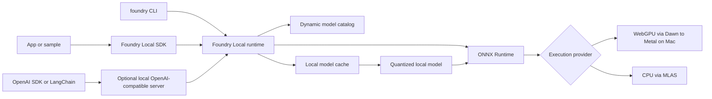
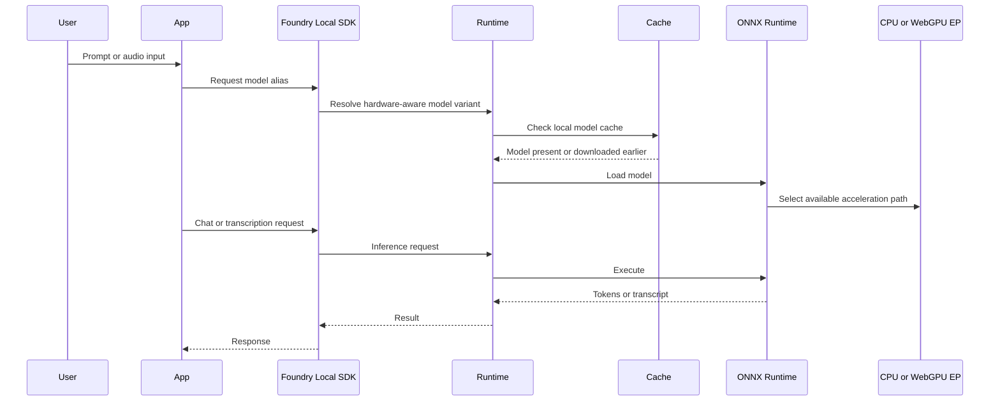
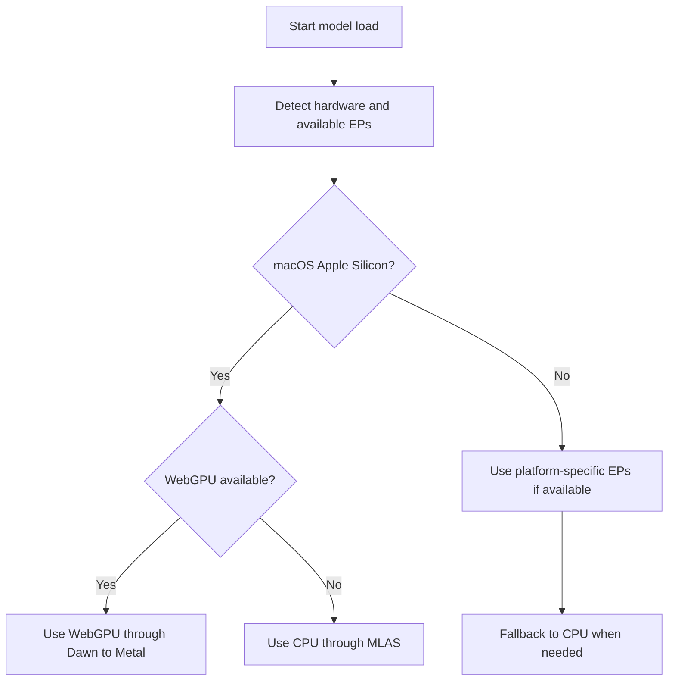

# Architecture

[Back to repo README](../README.md) | Previous: [Overview](01-overview.md) | Next: [Mac setup](03-mac-setup.md)

Azure AI Foundry Local is a local runtime and SDK stack for on-device AI. It uses ONNX Runtime underneath, picks hardware acceleration through execution providers, manages a local model cache, and can expose models through either embedded SDK clients or an optional OpenAI-compatible local server.

## Components

| Component | Role |
| --- | --- |
| Lightweight runtime | Installs the local runtime, about 20 MB, and hosts local inference capabilities. |
| ONNX Runtime engine | Executes optimized model graphs on the device. |
| Execution providers | Hardware-specific acceleration libraries used by ONNX Runtime. |
| Local model cache | Stores downloaded model variants and execution provider artifacts. |
| SDK | Primary integration surface for apps in C#, JavaScript, Python, and Rust. |
| Optional local server | Exposes an OpenAI-compatible REST endpoint on a local dynamic port. |
| CLI | Developer workflow surface for model, service, and cache commands. |

## Architecture diagram

## End-to-end request flow

## Hardware acceleration selection

Foundry Local auto-detects hardware and picks the best available execution provider, with CPU fallback.

## Mac Apple Silicon execution provider story

On macOS Apple Silicon, the relevant execution providers are:

| Provider | Mac role |
| --- | --- |
| CPUExecutionProvider | Universal fallback using MLAS. |
| WebGpuExecutionProvider | GPU path using Dawn, which targets Metal on Mac. |

Do not expect CUDA on Mac. CUDA is NVIDIA-only. Do not expect an NPU execution provider on Mac. Do not assume CoreML or Apple Neural Engine support for Foundry Local. The safe Mac guidance is CPU through MLAS plus WebGPU through Dawn to Metal, with automatic fallback to CPU.

## SDK first, server optional

The SDK is the primary product surface. Use it when you are building a local app and want lifecycle control over execution providers, downloads, loading, unloading, chat, streaming, and audio.

Use the optional OpenAI-compatible server when you want existing OpenAI SDK or LangChain code to talk to a local endpoint. The endpoint uses a dynamic local port. Discover it with `foundry service status` or through the SDK manager.

## Related docs

- Install the runtime with [Mac setup](03-mac-setup.md).
- Pick models with [Model catalog](04-model-catalog.md).
- Use the server with [REST API](07-rest-api.md).
- See the formal build plan in [Specs](09-specs.md).
